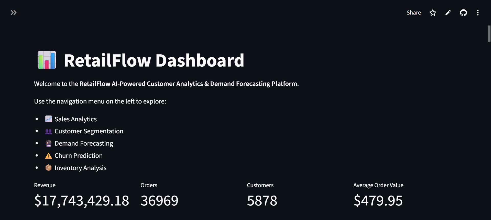
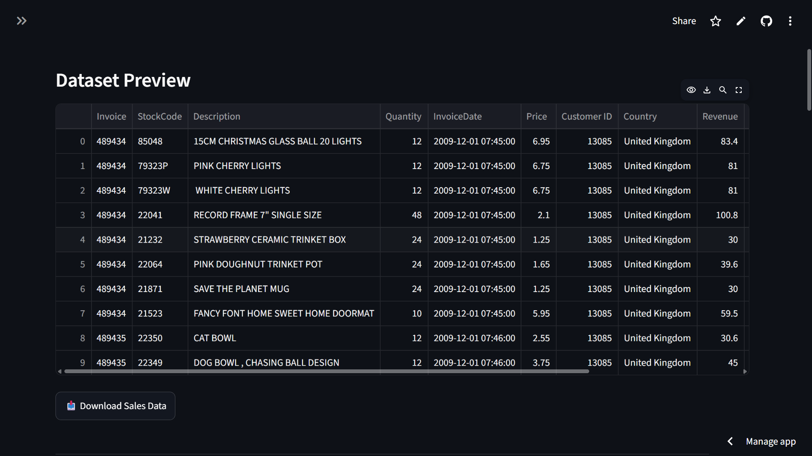
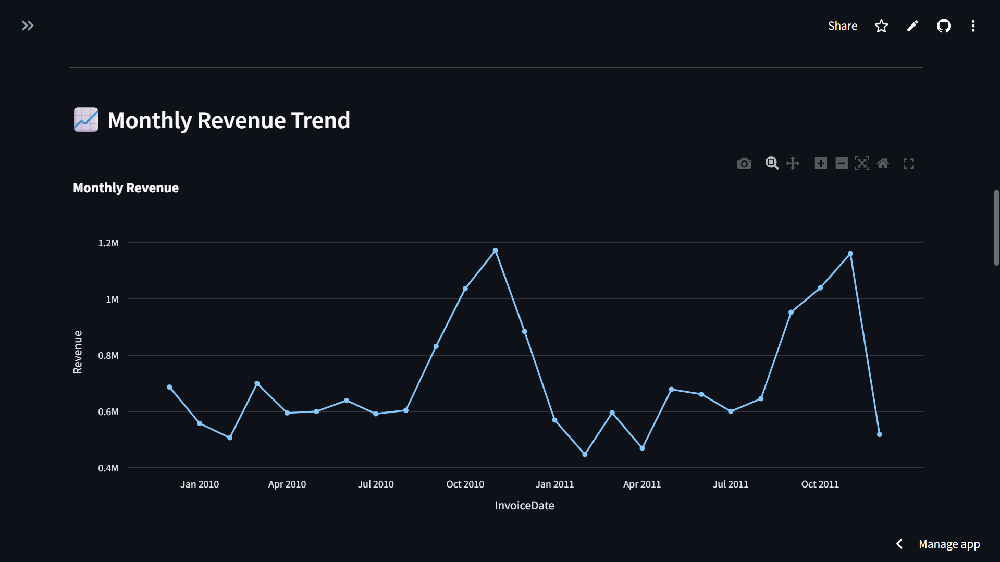
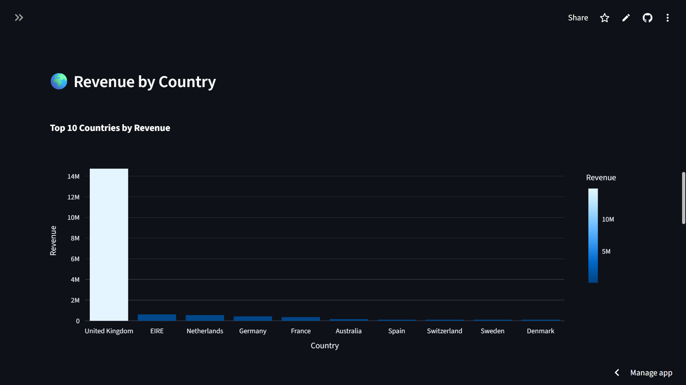
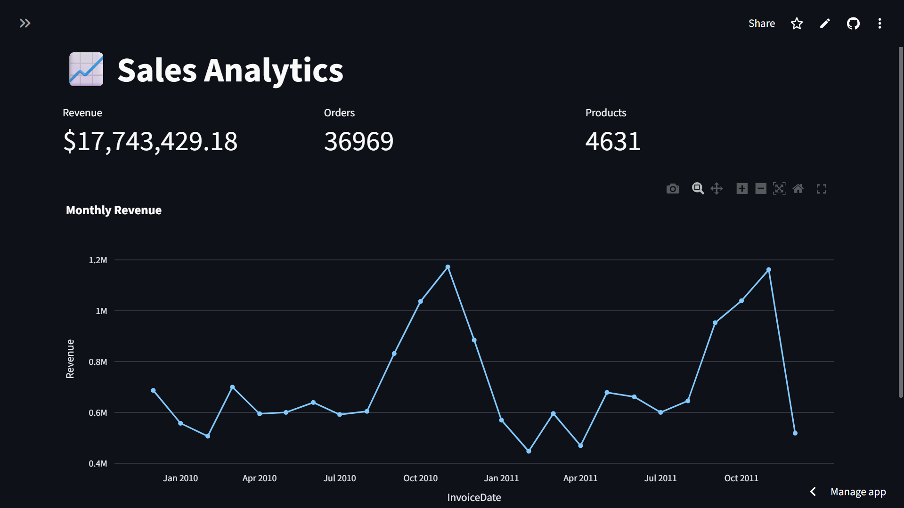
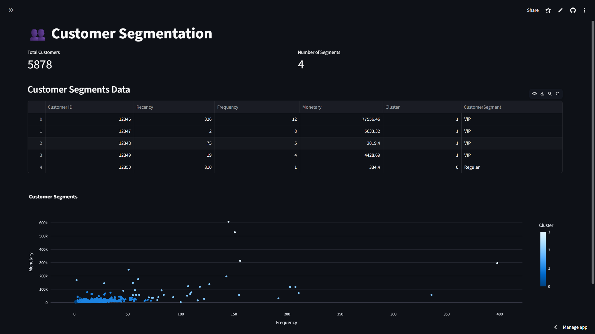
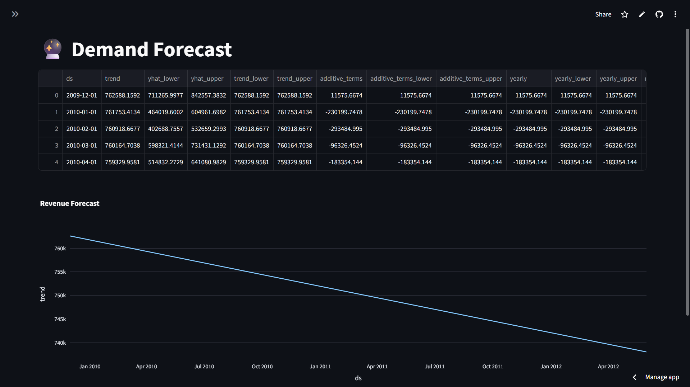
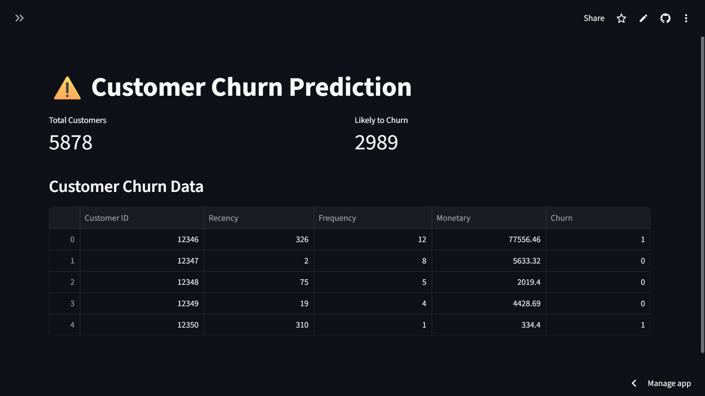
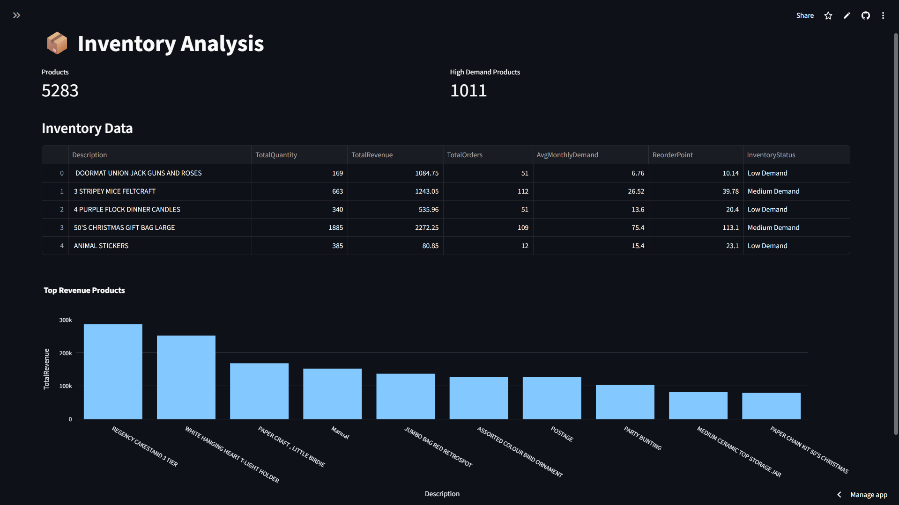

# RetailFlow

AI-Powered Customer Analytics & Demand Forecasting Platform

## Features

- Customer Segmentation
- Demand Forecasting
- Churn Prediction
- Inventory Optimization
- Interactive Dashboard

## Tech Stack

- Python
- Pandas
- Scikit-learn
- Prophet
- Streamlit
- Plotly

## Run Locally

```bash
pip install -r requirements.txt
streamlit run app.py
```
## Live Demo

**RetailFlow Dashboard**

https://retailflow.streamlit.app/

---

# Dashboard Preview

## 🏠 Home Dashboard


### Dataset Preview


### Revenue Trend


### Revenue by Country


---

## 📈 Sales Analytics



---

## 👥 Customer Segmentation



---

## 🔮 Demand Forecasting



---

## ⚠️ Churn Prediction



---

## 📦 Inventory Analysis

